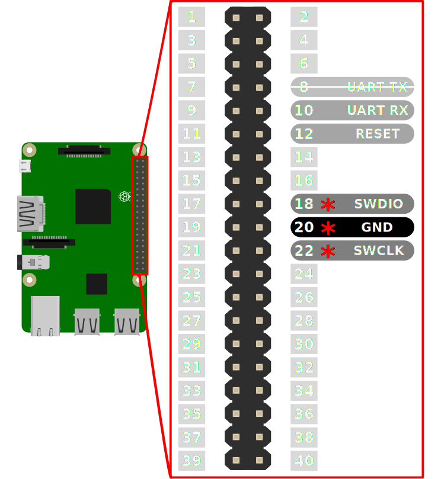

MCU Programmer
==============

MCU programmer/debugger running wirelessly on a Raspberry Pi.

Compatible Raspberry Pi models:

- Raspberry Pi 3
- Raspberry Pi 4
- Raspberry Pi 5
- Raspberry Pi Zero 2 W (cheapest and preferred option)


## Raspberry PI SWD pinout



- &#10033; Required
- **RESET** is optional
- **UART RX** is for optional serial debug
- **UART TX** should not be connected


## Usage

### Configure target device

The target MCU can be set through a telnet service running on port `8888`.  
Connect to the service and select the target device:

```bash
telnet mcuprogrammer.local 8888
```

```
Trying mcuprogrammer.local...
Connected to mcuprogrammer.local.
Escape character is '^]'.
Connected to MCU Programmer CLI. Type 'help' for a list of commands
```

```bash
target rp2040
```

MCU Programmer supports every target supported by the latest build of OpenOCD.

### Program from remote:

```bash
arm-none-eabi-gdb -ex="target remote mcuprogrammer.local:3333" my-firmware.elf -ex "load" -ex "monitor reset" -ex "det" -ex "q"
```

Use `continue` command to run program.  
Press `<ctrl+c>` to exit debug session.  
Reset device through the GDB `monitor` interface:

```gdb
(gdb) monitor reset
```

### Serial debug

MCU Programmer exposes a network service at port `1337` which echoes all serial messages received on `UART RX`.

You can connect to this service from a remote machine using `netcat`:

```bash
nc mcuprogrammer.local 1337
```


## Install

### Prerequisites

- Raspberry PI 3/4/5/Zero 2 W
- [Latest SB01Programmer image](https://github.com/elektrofon/mcu-programmer/releases/latest) (no need to unzip)
- [Raspberry Pi Imager](https://www.raspberrypi.com/software/)

### Flash SD card

1. Open Raspberry Pi Imager
2. Click `CHOOSE OS`
3. Click `Use Custom` and select the MCUProgrammer image downloaded above
4. Click the cogwheel at the bottom right corner
5. Add your Wi-Fi credentials and save
6. Click `WRITE`
7. Boot your Raspberry PI with the SD card you just flashed


## Building locally (for developers)

Build script can be found in `.github/workflows/main.yml`

### Setup build environment

#### MacOS

Install [act](https://github.com/nektos/act) and [gh](https://cli.github.com/):

```bash
brew install gh act
```

#### Linux (Debian/Ubuntu)

Install Docker:

```bash
curl -fsSL https://get.docker.com -o install-docker.sh
sudo sh install-docker.sh
```

Install [`act`](https://github.com/nektos/act#bash-script):

```bash
cd /
curl -s https://raw.githubusercontent.com/nektos/act/master/install.sh | sudo bash
```

Install [`gh`](https://github.com/cli/cli/blob/trunk/docs/install_linux.md#debian-ubuntu-linux-raspberry-pi-os-apt):

```bash
type -p curl >/dev/null || (sudo apt update && sudo apt install curl -y)
curl -fsSL https://cli.github.com/packages/githubcli-archive-keyring.gpg | sudo dd of=/usr/share/keyrings/githubcli-archive-keyring.gpg \
&& sudo chmod go+r /usr/share/keyrings/githubcli-archive-keyring.gpg \
&& echo "deb [arch=$(dpkg --print-architecture) signed-by=/usr/share/keyrings/githubcli-archive-keyring.gpg] https://cli.github.com/packages stable main" | sudo tee /etc/apt/sources.list.d/github-cli.list > /dev/null \
&& sudo apt update \
&& sudo apt install gh -y
```

### Building Raspberry PI image

Sign in to git to get access token (this only has to be done once):

```bash
gh auth login
```

Build image:

```bash
act -s GITHUB_TOKEN="$(gh auth token)" --artifact-server-path ./build
```


## Connecting to the Raspberry PI

SSH is enabled and can be reached at `mcuprogrammer.local`:

```bash
ssh mcuprogrammer@mcuprogrammer.local
```

Default username: `mcuprogrammer`  
Default password: `mcuprogrammer`


## Troubleshooting

### **Case:** Host cannot resolve (find) `mcuprogrammer.local`

Most likely it's an issue with your local network, specificaly a subnet issue. mDNS cannot operate across networks. If your Wi-Fi brodcasts multiple bands on the same SSID, and your computer is on 5GHz and the `MCU Programmer` is on the 2.4GHz, this could result in them not resolving each others mDNS services.

#### Solution:
Add a DNS entry in the host machines `/etc/hosts` file:

```txt
[MCU Programmer IP] mcuprogrammer.local
```
Replace [MCU Programmer IP] with the MCU Programmer IP address on your network.

